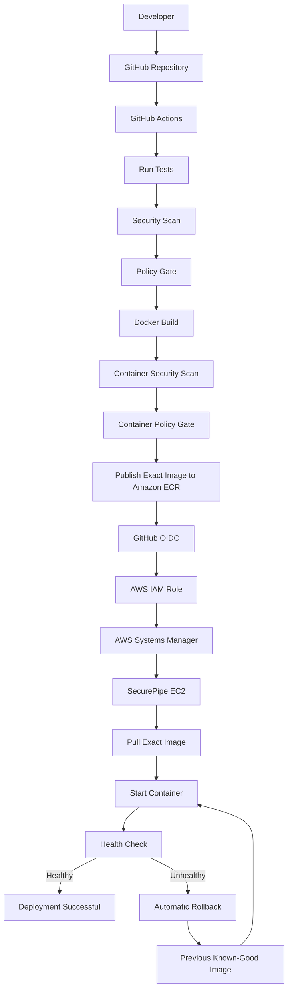
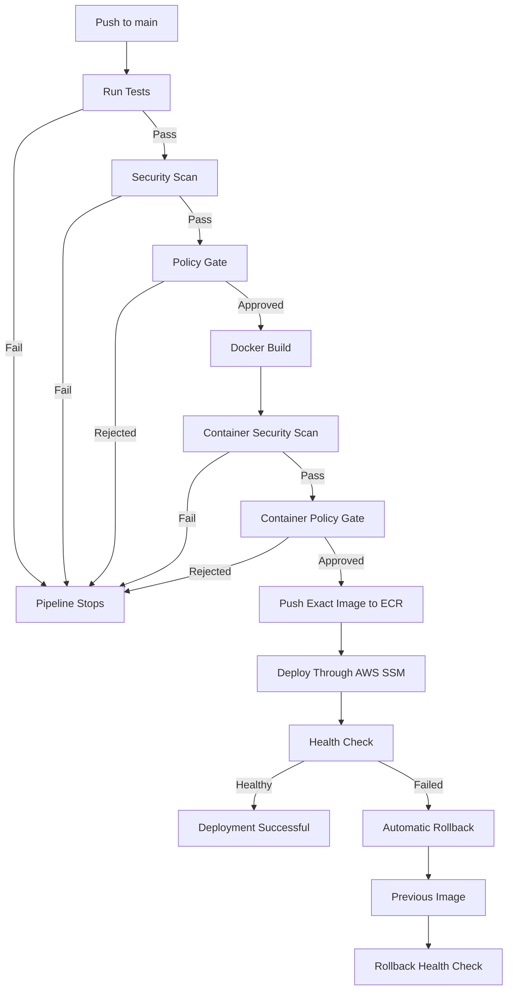
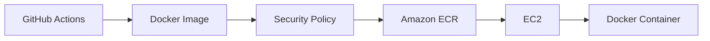
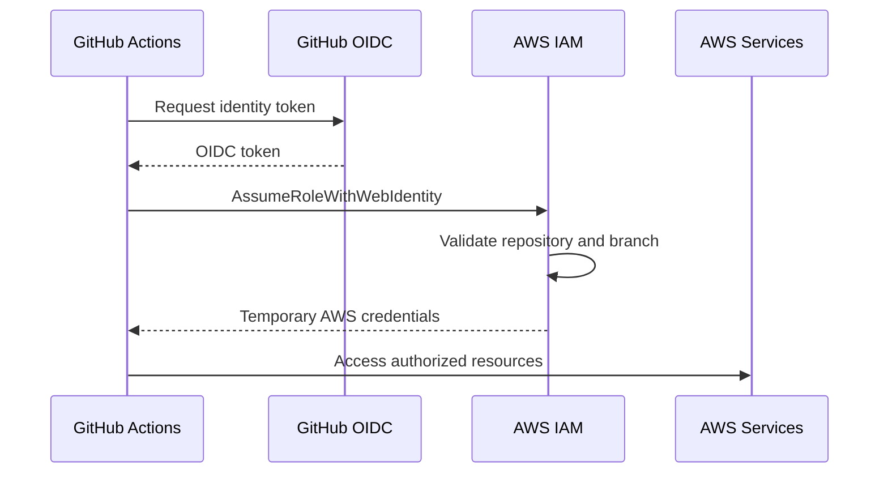
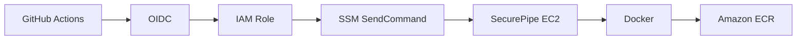
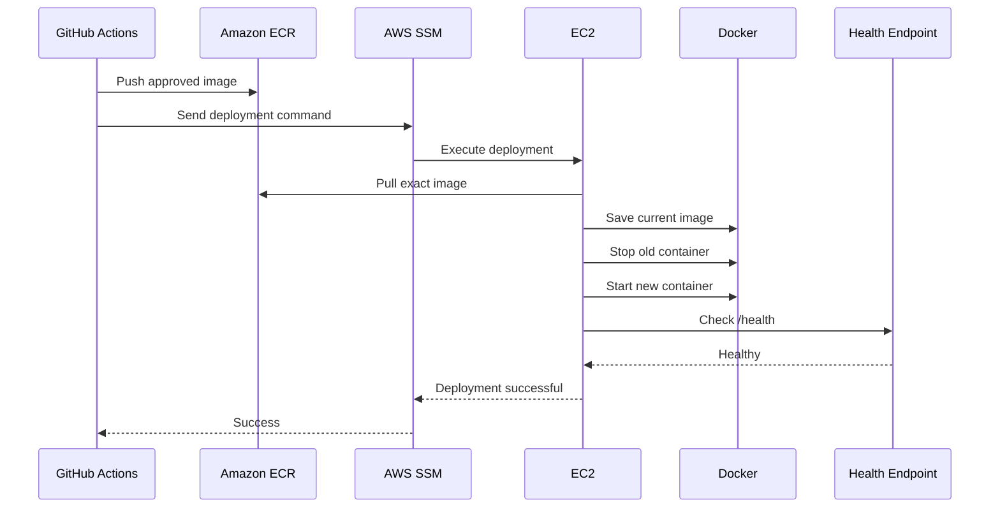
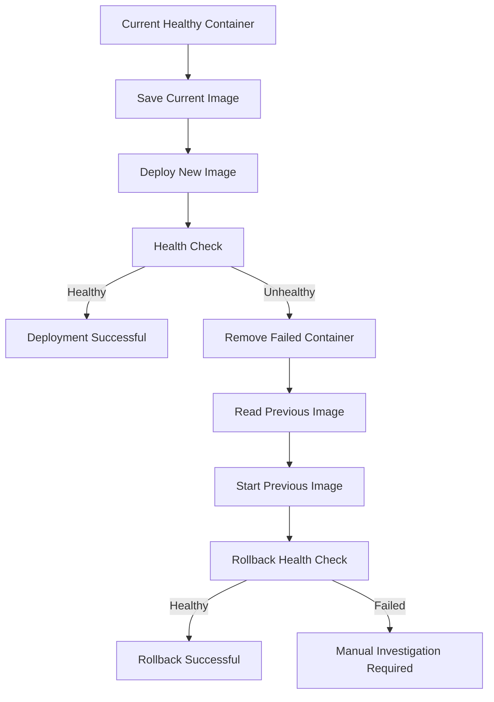
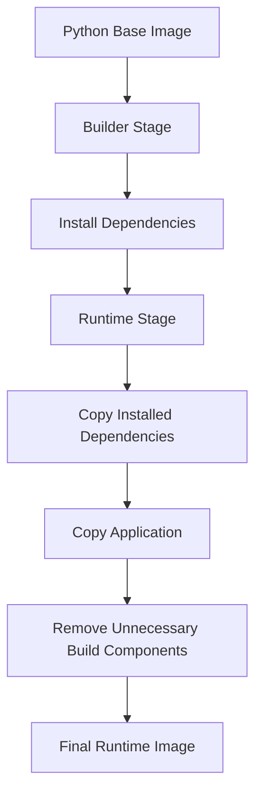
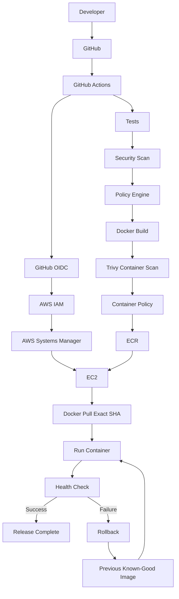

# SecurePipe — DevSecOps CI/CD Pipeline with Automated Security Gates and Rollback

**SecurePipe** is a DevSecOps CI/CD pipeline that integrates automated testing, vulnerability scanning, security policy enforcement, containerization, artifact publishing, and safe deployment into a single delivery workflow.

The project demonstrates how security can become a mandatory part of the software delivery process instead of an activity performed after deployment.

---

## Version

**v1.0.0**

**Status:** Completed

**Branch:** `main`

---

## Problem Statement

A traditional CI/CD pipeline may build, test, and deploy an application without checking whether the resulting container image contains known security vulnerabilities.

A pipeline can therefore reach this state:

```text
Code
  ↓
Build
  ↓
Tests Pass
  ↓
Deploy
  ↓
Known Vulnerabilities Reach Runtime
```

SecurePipe introduces security and deployment-safety controls directly into the delivery pipeline.

The core principle is:

> An application should not be deployed automatically unless it passes the required tests and security policy.

SecurePipe also verifies the running application after deployment and automatically restores the previous known-good image when the new deployment fails its health check.

---

# Goals

SecurePipe was built to demonstrate:

- Automated CI/CD
- Automated application testing
- Docker containerization
- Vulnerability scanning
- Security policy enforcement
- Container image security
- Secure AWS authentication
- Artifact traceability
- Automated deployment
- Deployment health verification
- Automatic rollback
- Least-privilege IAM
- Practical DevSecOps engineering

---

# Architecture

## Complete Pipeline



---

# CI/CD Flow



---

# Technology Stack

| Technology | Purpose |
|---|---|
| Python | Application development |
| FastAPI | Application API |
| Uvicorn | Application server |
| Pytest | Automated testing |
| Docker | Containerization |
| Trivy | Vulnerability scanning |
| GitHub Actions | CI/CD automation |
| Amazon ECR | Container image registry |
| Amazon EC2 | Deployment target |
| AWS Systems Manager | Remote deployment |
| AWS IAM | Access control |
| GitHub OIDC | Secure AWS authentication |
| Linux | Runtime environment |
| Bash | Automation |

---

# Security Pipeline

SecurePipe introduces security checks before deployment.

```text
Source Code
    ↓
Application Tests
    ↓
Security Scan
    ↓
Security Policy
    ↓
Docker Build
    ↓
Container Security Scan
    ↓
Container Policy
    ↓
Amazon ECR
    ↓
Deployment
```

There are two important security checkpoints:

1. Application/source-level security validation
2. Final container-image security validation

The second check is important because the final image may contain vulnerabilities originating from:

- Operating system packages
- Base image packages
- Python dependencies
- Runtime dependencies

---

# Trivy Scanning

SecurePipe uses **Trivy** to identify known vulnerabilities in the container image.

The scanner produces vulnerability findings which are then evaluated by the SecurePipe policy engine.

The pipeline therefore separates:

```text
Vulnerability Detection
```

from:

```text
Deployment Decision
```

Trivy identifies the findings.

SecurePipe's policy engine determines whether the findings should block the deployment.

---

# Vulnerability Policy Engine

SecurePipe contains a policy engine that evaluates vulnerability findings against configurable rules.

Example policy:

```json
{
  "max_medium": 10,
  "max_low": 50,
  "block_on_critical": true,
  "block_on_high": true,
  "ignored_vulnerabilities": []
}
```

The policy engine considers:

- Critical vulnerabilities
- High vulnerabilities
- Medium vulnerabilities
- Low vulnerabilities
- Fixable vulnerabilities
- Unfixable vulnerabilities
- Explicitly ignored vulnerabilities

This allows security policy to be separated from the scanner itself.

---

# Fixable vs Unfixable Vulnerabilities

A vulnerability can exist even when no patched package version is currently available.

SecurePipe therefore distinguishes between findings that can currently be remediated and findings for which no fix is available.

Conceptually:

```text
Vulnerability Found
        ↓
Is a Fix Available?
       / \
     Yes  No
      ↓    ↓
 Evaluate  Report/Evaluate
 Policy    According to Policy
```

This avoids treating every scanner finding as an automatic deployment failure regardless of whether remediation is technically available.

---

# Build Once, Deploy the Same Artifact

SecurePipe follows an important CI/CD principle:

> Build once, scan the exact artifact, and deploy that exact artifact.

The Git commit SHA is used as the Docker image tag.

Example:

```text
854469103418.dkr.ecr.us-east-1.amazonaws.com/securepipe:<git-sha>
```

The artifact flow is:

```text
Git Commit
    ↓
Docker Image
    ↓
Security Scan
    ↓
Policy Gate
    ↓
Amazon ECR
    ↓
EC2 Deployment
```

The application is not rebuilt after the security scan.

The image that passes the pipeline is the image that gets deployed.

This improves:

- Traceability
- Reproducibility
- Deployment confidence
- Auditability

---

# Amazon ECR

Amazon Elastic Container Registry is used as the private container registry.

The approved image is pushed to ECR before deployment.



The EC2 instance pulls the exact image identified by the Git commit SHA.

---

# GitHub OIDC Authentication

SecurePipe uses GitHub Actions OIDC instead of storing long-lived AWS access keys inside GitHub Actions.



The IAM trust relationship is restricted to the intended GitHub repository and `main` branch.

This provides temporary AWS credentials to the workflow instead of requiring permanent AWS credentials.

---

# IAM Design

SecurePipe separates AWS responsibilities between GitHub Actions and EC2.

## GitHub Actions Role

The GitHub Actions role is responsible for:

- Authenticating to Amazon ECR
- Pushing the approved image
- Sending deployment commands through AWS Systems Manager
- Reading deployment command results

The role is not intended to have administrator permissions.

## EC2 Role

The EC2 instance role is responsible for:

- AWS Systems Manager management
- Pulling images from Amazon ECR

The EC2 role does not require permission to push images.

This separation follows the principle of least privilege.

---

# AWS Systems Manager

SecurePipe uses **AWS Systems Manager** instead of SSH for automated deployment.



This avoids requiring SSH credentials inside the CI/CD workflow.

The deployment command is delivered to the EC2 instance through Systems Manager.

---

# Deployment Process

The deployment process performs the following operations:

```text
1. Authenticate Docker to ECR
2. Pull the exact Git SHA image
3. Identify the currently running SecurePipe image
4. Save the current image as the rollback target
5. Stop the current container
6. Start the new container
7. Wait for application startup
8. Perform repeated health checks
9. Mark deployment successful if healthy
10. Roll back automatically if health checks fail
```

---

# Deployment Architecture



---

# Health Check

SecurePipe exposes:

```text
GET /health
```

A successful Docker process alone is not considered sufficient evidence of a successful deployment.

The deployment verifies the application itself:

```text
Container Started
       ↓
Application Startup
       ↓
/health
       ↓
HTTP Success
       ↓
Deployment Accepted
```

The health check uses a retry loop rather than relying on a single fixed sleep.

This protects the deployment from false failures caused by normal application startup time.

---

# Automatic Rollback

Before replacing the current deployment, SecurePipe records the currently running image.

```text
Current Healthy Image
        ↓
Save Rollback Target
        ↓
Deploy New Image
        ↓
Health Check
       / \
    Pass  Fail
     ↓      ↓
 Success   Remove Failed Container
                ↓
          Restore Previous Image
                ↓
          Start Previous Image
                ↓
          Rollback Health Check
```

The rollback image is stored as the previous known-good deployment target.

---

# Rollback Architecture



Rollback itself is health-checked.

This is important because starting the previous image does not automatically prove that the application has recovered.

---

# Controlled Rollback Testing

The rollback mechanism was intentionally tested by simulating a failed deployment.

The test flow was:

```text
Healthy Deployment
       ↓
Intentional Container Failure
       ↓
Health Check Failure
       ↓
Automatic Rollback
       ↓
Previous Image Restored
       ↓
Rollback Health Check
```

This validated the deployment safety mechanism independently from normal successful deployments.

---

# Containerization

SecurePipe uses a multi-stage Docker build.



The builder stage handles dependency installation.

The runtime stage contains the application and required runtime dependencies.

This separates build-time requirements from the final runtime environment.

---

# Application Testing

SecurePipe includes automated tests executed by the CI pipeline.

The completed project reached:

```text
32 passed
2 warnings
```

The test stage runs before the security and deployment stages.

If tests fail, the pipeline stops and deployment does not proceed.

---

# Pipeline Failure Behavior

SecurePipe uses sequential gates.

```text
Run Tests
   │
   ├── FAIL → STOP
   │
   ▼
Security Scan
   │
   ├── FAIL → STOP
   │
   ▼
Policy Gate
   │
   ├── REJECT → STOP
   │
   ▼
Docker Build
   │
   ▼
Container Security Scan
   │
   ├── FAIL → STOP
   │
   ▼
Container Policy Gate
   │
   ├── REJECT → STOP
   │
   ▼
Publish to ECR
   │
   ▼
Deploy
   │
   ▼
Health Check
   │
   ├── FAIL → ROLLBACK
   │
   ▼
SUCCESS
```

Security therefore becomes part of the release decision.

---

# Repository Structure

```text
SecurePipe/
│
├── app/
│   ├── ...
│   └── ...
│
├── policies/
│   └── container.json
│
├── tests/
│   ├── ...
│   └── ...
│
├── .github/
│   └── workflows/
│       └── ci.yml
│
├── Dockerfile
├── requirements.txt
├── policy_engine.py
├── README.md
└── ...
```

---

# Local Development

Create a virtual environment:

```bash
python3 -m venv .venv
```

Activate it:

```bash
source .venv/bin/activate
```

Install dependencies:

```bash
pip install -r requirements.txt
```

Run tests:

```bash
pytest -v
```

---

# Docker Usage

Build the image:

```bash
docker build -t securepipe .
```

Run the application:

```bash
docker run --rm -p 8000:8000 securepipe
```

Health endpoint:

```text
http://localhost:8000/health
```

---

# Local Security Scan

Run Trivy against the container image:

```bash
trivy image securepipe
```

The resulting vulnerability information can be evaluated using the SecurePipe policy engine.

---

# Engineering Decisions

## Why GitHub Actions?

GitHub Actions integrates directly with the GitHub repository and provides the CI/CD execution environment for the project.

## Why Trivy?

Trivy provides container vulnerability scanning and integrates naturally into a CI/CD workflow.

## Why a Separate Policy Engine?

A scanner identifies vulnerabilities.

A policy engine decides whether those vulnerabilities should block deployment.

Separating these responsibilities makes the security decision configurable and testable.

## Why Docker?

Docker provides a consistent deployment artifact.

The same image can be:

```text
Built
 ↓
Scanned
 ↓
Approved
 ↓
Published
 ↓
Deployed
```

## Why ECR?

Amazon ECR provides a private AWS-native container registry that integrates with IAM and EC2.

## Why Git SHA Tags?

The Git commit SHA creates a direct relationship between source code and deployed artifact.

```text
Git Commit
    ↓
Docker Image Tag
    ↓
ECR Image
    ↓
EC2 Deployment
```

## Why OIDC?

OIDC avoids long-lived AWS credentials in GitHub Actions and provides temporary credentials through AWS IAM role assumption.

## Why Systems Manager?

Systems Manager allows the CI/CD pipeline to execute deployment commands without requiring SSH access or SSH keys.

## Why Automatic Rollback?

A deployment is not considered successful simply because the container starts.

The application must prove that it is healthy.

If it cannot, the previous known-good image is restored.

---

# Security Principles Demonstrated

SecurePipe demonstrates several practical DevSecOps principles:

### Shift Left

Security scanning happens during CI rather than after deployment.

### Fail Fast

Failures stop downstream deployment stages.

### Least Privilege

AWS permissions are separated according to responsibility.

### Short-Lived Credentials

GitHub Actions uses OIDC rather than permanent AWS credentials.

### Artifact Traceability

Git SHA image tags connect source code to deployed artifacts.

### Build Once, Deploy the Same Artifact

The image that passes the security pipeline is the image deployed to EC2.

### Defense in Depth

Security is checked at multiple stages rather than relying on a single scanner.

### Deployment Safety

Application health is verified after deployment.

### Automatic Recovery

Failed deployments can automatically restore the previous image.

---

# Project Completion Criteria

SecurePipe is considered complete when the following workflow operates successfully:

```text
Developer Push
      ↓
Automated Tests
      ↓
Security Scan
      ↓
Security Policy
      ↓
Docker Build
      ↓
Container Scan
      ↓
Container Policy
      ↓
ECR Publication
      ↓
OIDC Authentication
      ↓
SSM Deployment
      ↓
EC2 Container
      ↓
Health Check
      ↓
Successful Deployment
```

The project also includes tested rollback behavior:

```text
Deployment Failure
      ↓
Health Check Failure
      ↓
Automatic Rollback
      ↓
Previous Image
      ↓
Rollback Health Check
```

---

# Cost-Conscious AWS Design

The AWS deployment was intentionally designed to minimize unnecessary infrastructure.

The architecture uses:

- One EC2 instance
- Amazon ECR
- AWS Systems Manager
- IAM
- Default VPC networking

The project intentionally avoids unnecessary infrastructure such as:

- NAT Gateway
- Application Load Balancer
- RDS
- ECS cluster
- Multiple EC2 instances

The AWS resources used for the project can also be terminated after development/testing when they are no longer required.

---

# Limitations

SecurePipe is a portfolio and learning project rather than a production-grade enterprise platform.

Current limitations include:

- Single EC2 deployment target
- No high availability
- No load balancer
- No multi-instance deployment
- No blue/green deployment
- No canary deployment
- No centralized production logging
- No distributed tracing
- No persistent production database
- No advanced secrets-management workflow
- No multi-region deployment
- No automated infrastructure provisioning through Terraform yet

These limitations are intentional boundaries for the current project scope.

---

# Future Improvements

Potential future improvements include:

1. **Terraform Infrastructure as Code**

   Provision the AWS infrastructure automatically.

2. **Blue/Green Deployment**

   Run old and new versions simultaneously and switch traffic only after validation.

3. **Canary Deployment**

   Gradually expose a new version to a subset of traffic.

4. **Kubernetes Deployment**

   Move the deployment target from EC2 to Kubernetes.

5. **Ephemeral Environments**

   Create temporary environments for pull requests.

6. **Centralized Logging**

   Integrate CloudWatch or another centralized logging platform.

7. **Monitoring**

   Add Prometheus and Grafana metrics.

8. **Secret Management**

   Integrate AWS Secrets Manager or Parameter Store.

9. **Image Signing**

   Introduce artifact signing and verification.

10. **SBOM Generation**

    Generate and validate Software Bill of Materials artifacts.

11. **Dependency Scanning**

    Expand security scanning to source dependencies and infrastructure configuration.

12. **Infrastructure Security Scanning**

    Add tools such as Checkov or tfsec when Terraform is introduced.

13. **Policy as Code**

    Expand security decisions into a more comprehensive policy-as-code system.

14. **High Availability**

    Introduce multiple deployment targets behind a load balancer.

15. **Advanced Deployment Strategies**

    Add blue/green and canary deployment strategies.

---

# What This Project Demonstrates

SecurePipe demonstrates practical knowledge of:

```text
Linux
  ↓
Git
  ↓
Python
  ↓
Testing
  ↓
Docker
  ↓
CI/CD
  ↓
Security Scanning
  ↓
Policy Enforcement
  ↓
AWS IAM
  ↓
OIDC
  ↓
Amazon ECR
  ↓
AWS Systems Manager
  ↓
EC2
  ↓
Health Checks
  ↓
Automatic Rollback
```

The project is designed to demonstrate not only knowledge of individual tools, but also how those tools work together to solve a real engineering problem.

---

# Key Talking Points

The most important engineering concepts demonstrated by SecurePipe are:

### 1. Security Gates

Security checks are positioned before deployment so insecure artifacts do not automatically reach the runtime environment.

### 2. Artifact Immutability

The Git SHA identifies the exact image that was tested and approved.

### 3. OIDC

GitHub Actions obtains temporary AWS credentials instead of relying on long-lived access keys.

### 4. Least Privilege

GitHub Actions and EC2 have different IAM responsibilities.

### 5. Health-Based Deployment

Deployment success is determined by application health rather than only container startup.

### 6. Automatic Rollback

The previous known-good image is restored when the new deployment fails its health check.

### 7. Failure Isolation

Each pipeline stage acts as a gate for the next stage.

### 8. Build Once, Deploy Once

The exact artifact that passes security validation is deployed.

---

# Lessons Learned

Building SecurePipe provided practical experience with:

- Designing CI/CD pipelines
- Debugging GitHub Actions failures
- Understanding shell behavior in remote environments
- Docker image construction
- Container vulnerability analysis
- Security policy design
- AWS IAM permissions
- GitHub OIDC
- AWS Systems Manager
- ECR authentication
- EC2 deployment
- Health-check reliability
- Deployment rollback
- Infrastructure cleanup
- Debugging distributed CI/CD workflows

One important lesson was that deployment automation must account for real runtime behavior.

For example, a fixed delay before a health check can create a startup race condition. Repeated health checks are more reliable because application startup time can vary.

---

# Final Architecture Summary



---
# Final Note

SecurePipe was built as a practical demonstration of how a modern DevSecOps pipeline can combine:

```text
CI/CD
+
Security
+
Containers
+
Cloud
+
IAM
+
Automated Deployment
+
Health Verification
+
Rollback
```

into one controlled software delivery process.

The primary objective of the project is not simply to use many tools, but to understand the engineering responsibility of each tool and how the complete system behaves when something goes wrong.


# License

This project is licensed under the MIT License.

---

# Author

**Anurag Varma**

GitHub:

https://github.com/anuragdeploys

GitHub Repository:

https://github.com/anuragdeploys/SecurePipe
